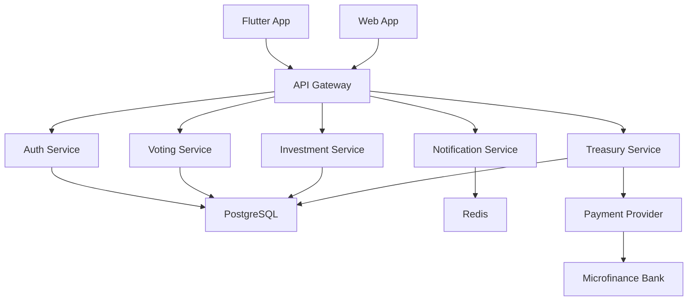

# 12th Cauldron — Product Requirements Document (PRD)

## Product Overview

### Product Name

**12th Cauldron**

### Product Category

Collaborative savings and investment platform.

### Core Mission

Enable trusted groups of youths to:

- save consistently,
- invest collectively,
- grow transparent community wealth,
- and achieve long-term ownership goals faster together.

---

# Problem Statement

Young people in Nigeria and emerging markets struggle to:

- maintain saving discipline,
- access trustworthy investment systems,
- build wealth collectively,
- and afford large assets independently.

Existing fintech apps optimize for:

- individual savings,
- isolated investing,
- or informal contribution systems lacking transparency.

12th Cauldron solves this by combining:

- social accountability,
- pooled investing,
- transparent treasury tracking,
- and milestone-based wealth building.

---

# Target Users

## Primary Users

- Youth savings circles
- University groups
- Church communities
- Friends/family investment circles
- Cooperative associations
- NYSC groups

## Secondary Users

- Diaspora family groups
- Creator/fan communities
- Professional communities

---

# Core Product Promise

> “Build wealth together through trusted circles.”

---

# V1 Objectives

Users should be able to:

1. Create invite-only groups
2. Contribute monthly
3. Vote on investments
4. Track pooled treasury growth
5. Monitor milestone goals
6. Receive proportional returns
7. Exit groups safely

---

# Success Metrics

| Metric                          | Goal                 |
| ------------------------------- | -------------------- |
| Monthly contribution completion | >80%                 |
| Group retention after 6 months  | >70%                 |
| Reinvestment rate               | >50%                 |
| Avg treasury growth             | Increasing quarterly |
| Group milestone completions     | Track monthly        |
| Contribution streak rate        | >60%                 |

---

# Product Scope (V1)

## Included

### Authentication

- Email/phone login
- OTP verification
- Invite-only onboarding

### Group Management

- Create groups
- Invite members
- Assign admins
- Risk profile settings

### Contributions

- Monthly recurring contributions
- Contribution tracking
- Missed payment handling
- Removal after 2 missed cycles

### Treasury

- Group treasury overview
- Personal ownership percentages
- Locked vs withdrawable balances

### Investment System

- Investment proposal voting
- Top 3 investment selection
- Automated investment execution
- ROI tracking

### Milestones

- Goal creation
- Group progress tracking
- Milestone achievement visualization

### Payouts

- End-of-cycle payouts
- Reinvestment options
- Voluntary exit handling

---

## Excluded (V1)

- Loans
- Public investment feeds
- Crypto investments
- P2P trading
- International banking
- AI portfolio management
- Fractional legal land ownership
- Public groups
- Secondary investment markets

---

# Core User Stories

## Story 1 — Join Group

### As a user

I want to join a trusted investment group via invite So I can save and invest collectively.

### Acceptance Criteria

```gherkin
Given a valid invite code
When the user signs up
Then they should join the assigned group

Given an invalid invite
When submitted
Then access should be denied
```

---

## Story 2 — Monthly Contributions

### As a member

I want to contribute monthly So my ownership share grows.

### Acceptance Criteria

```gherkin
Given a contribution due date
When payment succeeds
Then treasury balance updates

Given 2 missed payments
When the second cycle expires
Then the member is removed
And principal payout begins
```

---

## Story 3 — Investment Voting

### As a member

I want to vote on investment options So I participate in treasury decisions.

### Acceptance Criteria

```gherkin
Given active proposals
When users vote
Then top 3 proposals are ranked

Given voting closes
When admin finalizes
Then investment status becomes active
```

---

## Story 4 — Treasury Tracking

### As a member

I want transparent treasury visibility So I trust the platform.

### Acceptance Criteria

```gherkin
Given treasury data exists
When dashboard loads
Then users see:
- total treasury
- ROI
- investment allocations
- contribution history
- ownership percentage
```

---

## Story 5 — Voluntary Exit

### As a member

I want to leave safely So I can recover my contributions.

### Acceptance Criteria

```gherkin
Given active investments
When member exits
Then principal becomes withdrawable
And profits remain locked until maturity
```

---

# Tech Stack Recommendations

## Frontend Web

| Technology         | Reason                      |
| ------------------ | --------------------------- |
| Next.js App Router | Scalable SSR + API routes   |
| TypeScript         | Type safety                 |
| Tailwind CSS       | Fast UI iteration           |
| shadcn/ui          | Production-grade components |
| Framer Motion      | Financial animations        |
| Recharts           | Treasury visualization      |

---

## Backend

| Technology | Reason                         |
| ---------- | ------------------------------ |
| Node.js    | Strong ecosystem               |
| NestJS     | Structured fintech backend     |
| Prisma ORM | DB safety                      |
| PostgreSQL | Relational financial integrity |
| Redis      | Queueing/caching               |
| BullMQ     | Background jobs                |

---

## Mobile

| Technology | Reason                       |
| ---------- | ---------------------------- |
| Flutter    | Cross-platform performance   |
| Riverpod   | Predictable state management |

---

## Infrastructure

| Technology     | Reason             |
| -------------- | ------------------ |
| Vercel         | Web hosting        |
| Railway/Fly.io | Backend deployment |
| Neon/Supabase  | PostgreSQL hosting |
| GitHub Actions | CI/CD              |

---

# System Architecture



---

# Database Schema

## Users

| Field       | Type      |
| ----------- | --------- |
| id          | UUID      |
| full\_name  | String    |
| email       | String    |
| phone       | String    |
| role        | Enum      |
| created\_at | Timestamp |

---

## Groups

| Field           | Type    |
| --------------- | ------- |
| id              | UUID    |
| name            | String  |
| description     | Text    |
| risk\_profile   | Enum    |
| cycle\_duration | Integer |
| created\_by     | UUID    |

---

## GroupMembers

| Field                 | Type    |
| --------------------- | ------- |
| id                    | UUID    |
| group\_id             | UUID    |
| user\_id              | UUID    |
| contribution\_amount  | Decimal |
| ownership\_percentage | Decimal |
| status                | Enum    |

---

## Contributions

| Field     | Type      |
| --------- | --------- |
| id        | UUID      |
| user\_id  | UUID      |
| group\_id | UUID      |
| amount    | Decimal   |
| status    | Enum      |
| paid\_at  | Timestamp |

---

## InvestmentBuckets

| Field            | Type    |
| ---------------- | ------- |
| id               | UUID    |
| group\_id        | UUID    |
| name             | String  |
| projected\_roi   | Decimal |
| duration\_months | Integer |
| status           | Enum    |

---

## Votes

| Field        | Type    |
| ------------ | ------- |
| id           | UUID    |
| proposal\_id | UUID    |
| user\_id     | UUID    |
| vote         | Boolean |

---

## TreasuryTransactions

| Field       | Type      |
| ----------- | --------- |
| id          | UUID      |
| group\_id   | UUID      |
| type        | Enum      |
| amount      | Decimal   |
| reference   | String    |
| created\_at | Timestamp |

---

# Treasury Logic

## Ownership Formula

```text
User Ownership % =
User Total Contributions
÷
Total Group Contributions
× 100
```

---

## Exit Logic

### Voluntary Exit

- principal released,
- profits locked until maturity.

### Forced Removal

After:

- 2 missed cycles.

---

## Payout Logic

At maturity:

```text
User Return =
Ownership %
×
Total Profit Generated
```

---

# Security & Compliance

## Required

- Audit logs
- Transaction history
- Admin action logs
- Role permissions
- Data encryption
- Secure payment webhooks
- KYC-ready architecture

---

## Future Compliance

Prepare for:

- CBN regulation
- SEC cooperative/investment rules
- NDPR compliance

---

# API Structure

## Auth

| Method | Endpoint     |
| ------ | ------------ |
| POST   | /auth/signup |
| POST   | /auth/login  |
| POST   | /auth/verify |

---

## Groups

| Method | Endpoint       |
| ------ | -------------- |
| POST   | /groups        |
| GET    | /groups/\:id   |
| POST   | /groups/invite |

---

## Contributions

| Method | Endpoint               |
| ------ | ---------------------- |
| POST   | /contributions         |
| GET    | /contributions/history |

---

## Investments

| Method | Endpoint          |
| ------ | ----------------- |
| POST   | /investments/vote |
| GET    | /investments      |

---

## Treasury

| Method | Endpoint               |
| ------ | ---------------------- |
| GET    | /treasury              |
| GET    | /treasury/transactions |

---

# Frontend Structure

```text
apps/
 ├── web/
 │    ├── app/
 │    ├── components/
 │    ├── lib/
 │    ├── hooks/
 │    ├── services/
 │    └── styles/

 ├── mobile/
```

---

# Non-Functional Requirements

| Requirement    | Target          |
| -------------- | --------------- |
| API response   | <300ms          |
| Uptime         | 99.9%           |
| Accessibility  | WCAG AA         |
| Mobile support | Android-first   |
| Scalability    | 100k+ users     |
| Security       | OWASP-compliant |

---

# DevOps & CI/CD

## Environments

| Environment | Purpose     |
| ----------- | ----------- |
| Local       | Development |
| Staging     | QA          |
| Production  | Live users  |

---

## CI/CD Flow

```text
GitHub Push
    ↓
Lint + Tests
    ↓
Build Validation
    ↓
Preview Deploy
    ↓
Production Deploy
```

---

# Engineering Readiness Review

## /plan-eng-review

### Engineering Readiness Score

**8.9/10**

### Strengths

- Clear treasury logic
- Scalable modular architecture
- Defined investment lifecycle
- Strong trust and transparency systems
- Fintech-oriented infrastructure design
- Mobile-first architecture
- Future-ready compliance preparation

### Risks To Monitor

- Regulatory compliance evolution
- Treasury liquidity management
- Investment partner integrations
- Group dispute resolution systems
- Financial reconciliation edge cases

---

# Next Phase

Proceed to:

- Prompt Pack execution
- Monorepo initialization
- Backend architecture implementation
- Database migration planning
- Treasury engine construction

